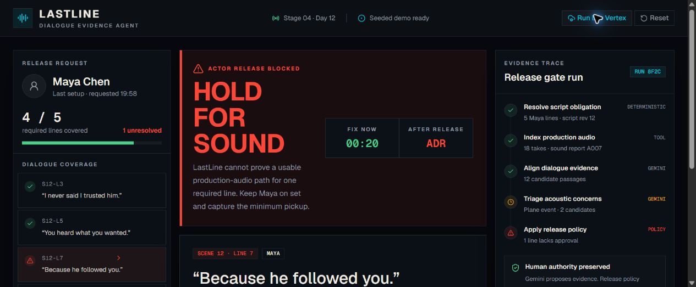
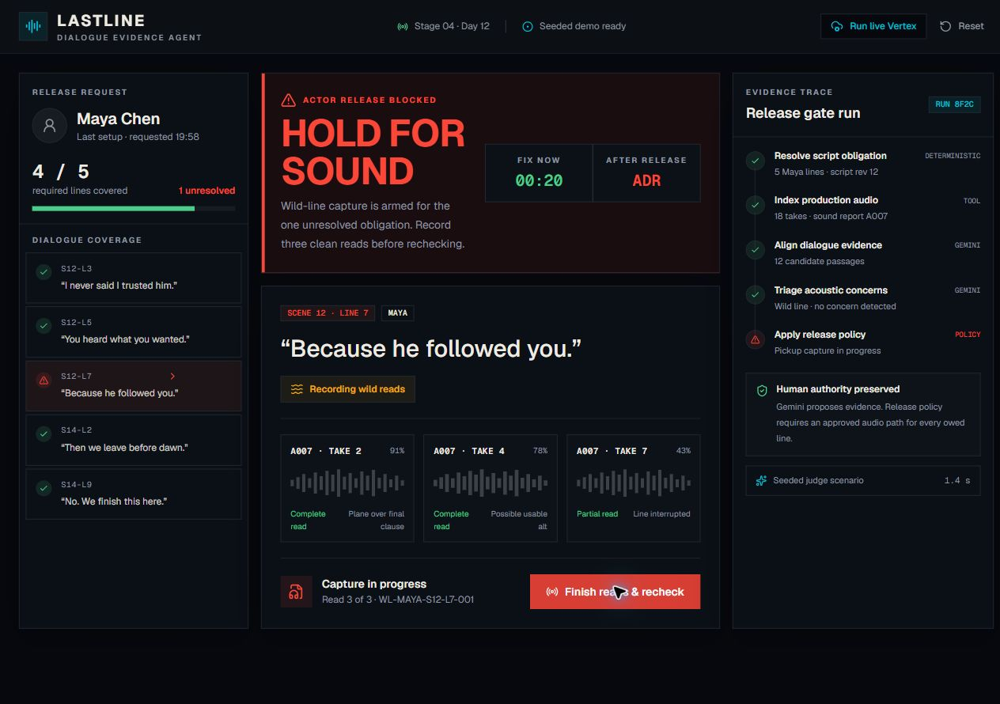
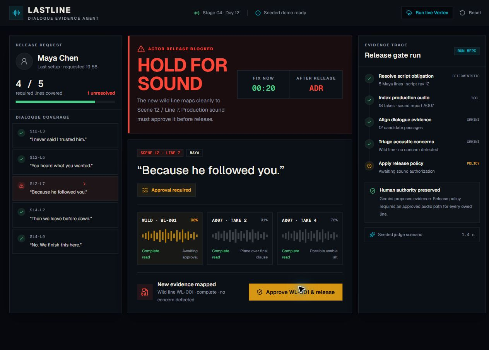
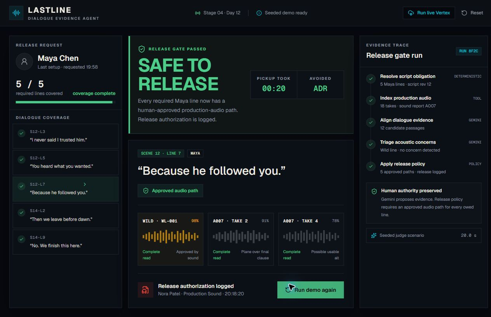

<div align="center">

# LASTLINE

### The actor-release gate that prevents avoidable ADR.

**HOLD FOR SOUND → capture the missing line → human approval → SAFE TO RELEASE**

[Try the live demo](https://lastline-release-gate.cinevault7.chatgpt.site) · [Follow the 2:35 demo](docs/demo-script.md) · [Inspect the architecture](docs/architecture.md)

</div>

---



At 7:58 PM, an actor is still on set and one owed sentence costs about 20 seconds to capture. After release, that same gap can become scheduling, an ADR stage, dialogue editorial, performance matching, and remixing.

LastLine reconciles an actor's scripted dialogue against the day's production-audio evidence **before the actor leaves**. If it cannot prove that every required line has a complete, human-approved audio path, it holds the actor and generates the minimum wild-line pickup.

> **One actor. One gate. No owed dialogue left behind.**

## The 20-second judge path

1. Open the console: Maya is blocked with exactly `1 unresolved` line.
2. Inspect the evidence: two complete candidates have concerns; one take is partial.
3. Click **Capture wild line**.
4. Click **Finish reads & recheck**.
5. Click **Approve WL-001 & release**.
6. See **SAFE TO RELEASE**, `5 / 5`, and the human approval trail.

The seeded path is intentionally synchronous so a judge never waits for an API. It is visibly labeled. **Run live Gemini** is a separate, honest cloud proof path and never swaps in fake fallback output.

## The gate closes the loop

| Capture only what is owed | Keep human sound authority | Release with an audit trail |
| --- | --- | --- |
|  |  |  |

## Why Gemini is necessary—and where it stops

Production dialogue rarely matches a script byte-for-byte. Gemini reasons across spoken performance, candidate audio, sound notes, transcript completeness, and semantic equivalence to propose evidence paths. Google ADK orchestrates the bounded reconciliation run and Pydantic validates its structured output.

Gemini **cannot** release an actor. A deterministic policy requires a complete evidence path plus explicit production-sound approval for every owed line. Even 99.9% model confidence remains HOLD without that approval; this invariant is executable in both the TypeScript and Python test suites.

```text
script + audio → Gemini evidence candidates → schema validation
                                               ↓
human sound approval ─────────────────→ deterministic gate
                                      ↙                    ↘
                            HOLD + minimum pickup     SAFE TO RELEASE
```

## Built for the operational moment

| Product decision | Why it matters |
| --- | --- |
| Verdict in the first viewport | The AD needs HOLD or CLEAR, not an analysis essay. |
| Exact line and evidence cards | Every recommendation is inspectable. |
| Minimum pickup, not a report | The agent closes the loop while the fix is cheap. |
| Human approval before CLEAR | Production sound keeps professional authority. |
| Seeded and live modes are separate | Demo reliability never compromises provenance. |

## Architecture

- **Release console:** React 19, TypeScript, Vinext, Tailwind, shadcn/Base UI.
- **Agent API:** Python 3.12, FastAPI, Pydantic.
- **AI runtime:** Gemini 3.5 Flash Lite through the Gemini Developer API; Google ADK + Vertex AI remains available through the containerized agent service.
- **Cloud:** restricted Google API key on project `lastline-agentic-cinema`; Sites/Cloudflare-compatible web runtime; optional Cloud Run API container.
- **Partner track:** IBM. Bob audited the release boundary and added a regression test proving phantom recording IDs cannot clear owed dialogue. The dated prompt, change, and verification are preserved in [`docs/ibm-bob/usage-2026-09-03.md`](docs/ibm-bob/usage-2026-09-03.md).

See the full [architecture and trust boundary](docs/architecture.md).

## Run it

### Web console

```bash
npm ci
npm run dev
```

Open `http://localhost:3000`. The complete seeded release loop needs no credentials.

### Agent API

```bash
cd agent
python -m venv .venv
# Windows: .venv\Scripts\activate
# macOS/Linux: source .venv/bin/activate
pip install -r requirements.txt
uvicorn app.main:app --reload --port 8080
```

Copy `.env.example` to `.env.local`. Set `GEMINI_API_KEY` for the no-billing Gemini Developer API path; it is read only by the server route and never reaches the browser. If `LASTLINE_API_URL` is set, the route uses the ADK/Vertex service instead and sends the matching server-only `LASTLINE_GATE_TOKEN`.

### Cost-bounded Cloud Run deployment

```powershell
$env:LASTLINE_GATE_TOKEN = '<at-least-32-random-characters>'
.\scripts\deploy-cloud-run.ps1 -ProjectId '<credit-backed-project-id>'
```

The deployment script fails closed when billing is unavailable, scales the service to zero, caps it at one instance, and requires a server-only gate token. It never creates or links a billing account.

## Verify it

```bash
npm run verify
npm run verify:gemini
cd agent && pytest -q
```

Current result: **12 web/live-boundary tests + 16 API/schema/policy tests pass**, the production web build succeeds, and the high-severity dependency audit is clean. A fresh production-route call and a separate official `@google/genai` SDK call both transcribed the synthetic WAV exactly; the sanitized proof is in [`docs/verification/live-gemini-2026-09-04.md`](docs/verification/live-gemini-2026-09-04.md). CI repeats build, lint, tests, and the high-severity dependency audit on every push and pull request.

## Repository map

```text
app/                    release console + same-origin live proxy
lib/                    typed evidence model + deterministic gate
agent/app/              ADK/Gemini API + authoritative policy
agent/tests/            schema, API, and release-invariant tests
tests/                  browser-policy invariant tests
docs/architecture.md    trust boundary and data flow
docs/demo-script.md     judge-ready 2:35 click script
docs/verification/      honest live integration evidence
docs/hackathon-build/   scope → PRD → spec → checked build plan
scripts/                guarded, scale-to-zero Cloud Run deployment
```

## Demo data and limitations

The Maya scenario is fictional. `public/demo-maya-wild-line.wav` is synthetic demonstration audio, not a real performer's voice. LastLine does not claim to replace production mixers, certify subjective audio quality, generate ADR, or grant legal release authority. It is a dialogue-evidence gate that keeps uncertainty visible until a sound professional approves a path.

The public live path uses the Gemini Developer API because Cloud Run remains blocked by the unavailable Cloud Billing account. The successful audio-backed request, structured evidence, usage metadata, and fail-closed HOLD decision are recorded in [`docs/verification/live-gemini-2026-09-04.md`](docs/verification/live-gemini-2026-09-04.md); the earlier honest Vertex billing failure remains recorded separately.

## License

[MIT](LICENSE) © 2026 Vivek Yarra
