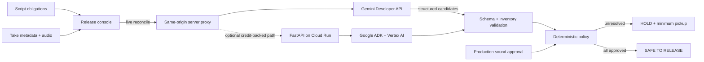

# Architecture and trust boundary

LastLine separates probabilistic evidence discovery from the release decision. Gemini can align a performance to a scripted line and flag acoustic concerns; it cannot release an actor.

## Decision ownership

| Concern | Owner | Can clear the actor? |
| --- | --- | --- |
| Semantic line-to-take alignment | Gemini | No |
| Transcript completeness and concern labels | Gemini, then schema validation | No |
| Professional usability | Production sound human | No, not alone |
| Every required line has a complete approved path | Deterministic policy | Yes |

The gate fails closed on missing input, malformed model output, unavailable cloud inference, partial dialogue, and unapproved evidence. The browser's seeded scenario, live TypeScript route, and Python service implement the same invariant and have independent tests. The browser calls a same-origin proxy, so neither the Gemini key nor the optional Cloud Run gate token reaches client code. The optional Cloud Run deployment is capped at one scale-to-zero instance.

## Runtime paths

- **Seeded judge path:** synchronous, network-independent HOLD → wild line → review → human approval → CLEAR. It is labeled as a seeded scenario.
- **Live judge path:** the web proxy sends a synthetic, labeled WAV and one script obligation to the Gemini Developer API. Structured output is validated against the submitted inventory before deterministic policy evaluates it. Errors are shown as errors; no seeded output is substituted.
- **Optional Vertex path:** when `LASTLINE_API_URL` is configured, the same proxy uses the protected FastAPI service, Google ADK, and Gemini on Vertex AI instead. This image is Cloud Run-compatible but is not required for the no-billing public demo.
- **Deployment:** the web app is Cloudflare Workers-compatible through Vinext/Sites. The Google API key is a secret in the server runtime and is restricted to the Gemini API.

## Data minimization

The demo includes no real performer voice or production material. `public/demo-maya-wild-line.wav` is synthetic demonstration audio. The live request is limited to one actor, selected dialogue obligations, short candidate audio, stable IDs, and bounded sound notes. The public route and Python API reject duplicate or oversized IDs, unsupported audio types, notes over 500 characters, recordings over 8 MiB, and combined decoded audio over 16 MiB.
