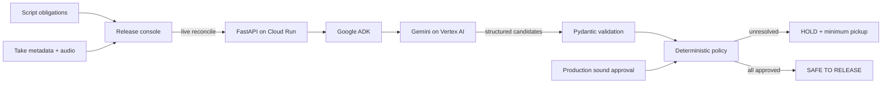

# Architecture and trust boundary

LastLine separates probabilistic evidence discovery from the release decision. Gemini can align a performance to a scripted line and flag acoustic concerns; it cannot release an actor.

## Decision ownership

| Concern | Owner | Can clear the actor? |
| --- | --- | --- |
| Semantic line-to-take alignment | Gemini | No |
| Transcript completeness and concern labels | Gemini, then schema validation | No |
| Professional usability | Production sound human | No, not alone |
| Every required line has a complete approved path | Deterministic policy | Yes |

The gate fails closed on missing input, malformed model output, unavailable cloud inference, partial dialogue, and unapproved evidence. The browser's seeded scenario and the Python service implement the same invariant and have independent tests.

## Runtime paths

- **Seeded judge path:** synchronous, network-independent HOLD → wild line → review → human approval → CLEAR. It is labeled as a seeded scenario.
- **Live cloud path:** the web proxy sends a synthetic, labeled WAV and one script obligation to the FastAPI service. Google ADK invokes Gemini on Vertex AI. Errors are shown as errors; no seeded output is substituted.
- **Deployment:** the web app is Cloudflare Workers-compatible through Vinext/Sites. The API image is Cloud Run-compatible.

## Data minimization

The demo includes no real performer voice or production material. `public/demo-maya-wild-line.wav` is synthetic demonstration audio. The live request is limited to one actor, selected dialogue obligations, short candidate audio, stable IDs, and sound notes. The API rejects duplicate IDs, unsupported audio types, and audio payloads over 8 MiB.
